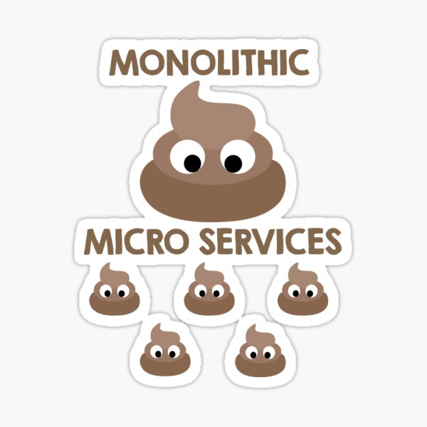
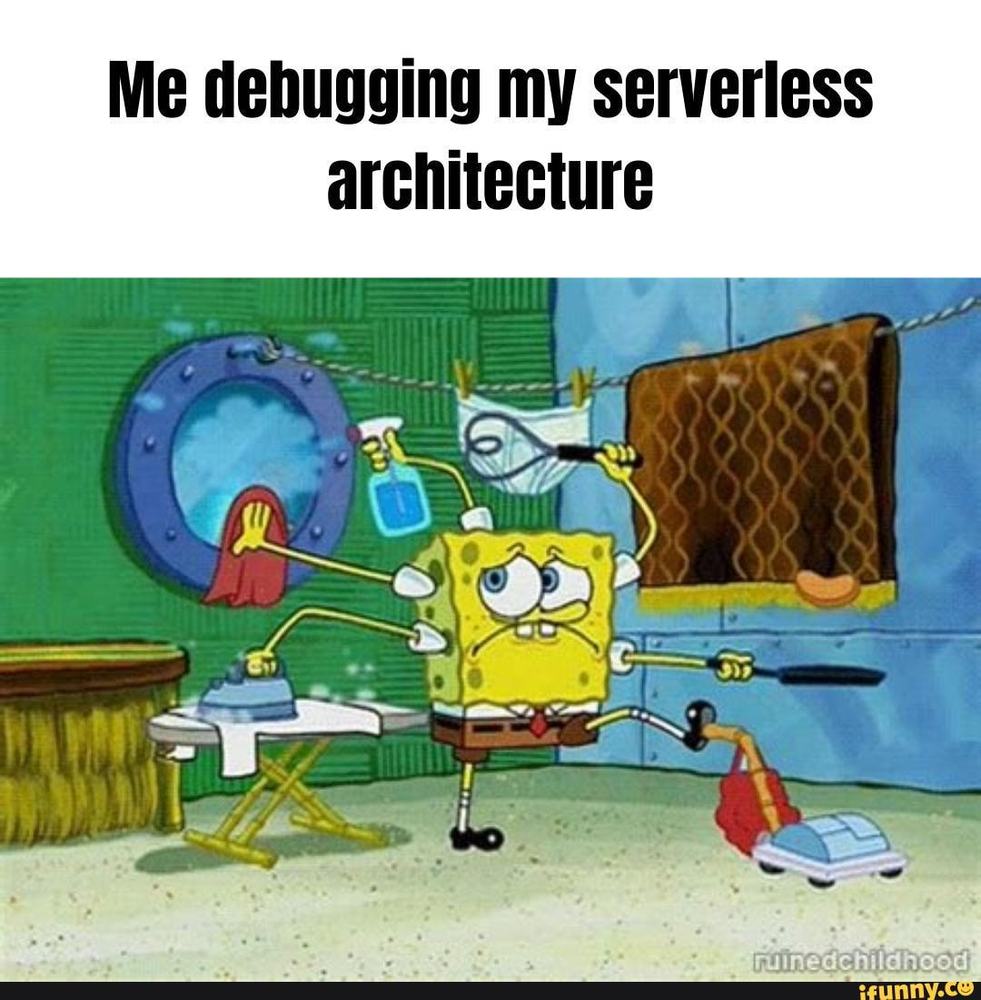

# Architecture

---

## Software Architecture

> The shared understanding that expert developers have of the system design.

and

> The decisions you wish you could get right early in the project.

but mostly

> Architecture is about the important stuff. Whatever that is.

Quotes from [martinfowler.com](https://martinfowler.com/architecture/)

---

## What is an application?

- A social construct
- Something for people, created by people, funded by people
- Has (blurry or well-defined) boundaries

---

## Enterprise architecture

- Is a loose architecture inside an enterprise concerning communication between different applications.
- Not concerned with individual applications.

---

## Software architecture - examples

- Monoliths
- Microservices
- Serverless

---

### Monoliths

---

### Serverless

---

### Microservices

- Your application is an collection of loosely-coupled services.
- Lightweight, both in development and deployment.
- Boundaries; does something (hopefully) well and only that thing. No more, no less.

---

### Microservices - Pro

- Codebase controlled by one team.
- Team picks the internal architecture, the language, design process, ...
- Ownership (you run it, you own it).
- Lightweight instances with limited functionality/dependencies make it easier to manage on the devops side.

---

## Microservices - Con

- Eventual consistency
- Distributed, remote calls can add up
- Operational complexity

---

## Microservices - Edges

- REST endpoints
- [GraphQL](https://graphql.org/)
- [RPC](https://en.wikipedia.org/wiki/Remote_procedure_call)
- ...

---

## Microservices - Client side

- Consider the example of bol.com
- Has a phone app on multiple platforms
- A web-interface
- An external API for 3rd party
- You should use an [API gateway](https://microservices.io/patterns/apigateway.html) for this.

---

## Microservices - Best practices

- SRP (single responsibility principle)
- Own your data and your infrastructure
- Own your release cycles
- Asynchronous (work with events)
- Fail fast ([Circuit breaker](https://en.wikipedia.org/wiki/Circuit_breaker_design_pattern))
- Versioning and the enterprise ecosystem

---

## Why is this important?

Higher **internal** quality leads to higher **external** quality.

- End users only care about functionality
- Higher internal quality increases external quality. Why?
