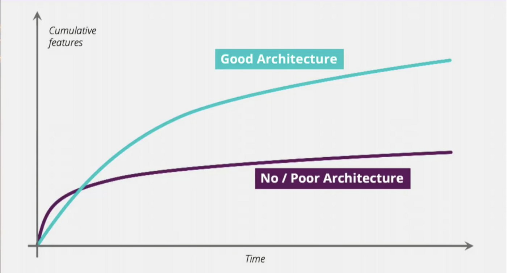

# Architecture

---

## Software Architecture

> The shared understanding that expert developers have of the system design.

and

> The decisions you wish you could get right early in the project.

but mostly

> Architecture is about the important stuff. Whatever that is.

Quotes from [martinfowler.com](https://martinfowler.com/architecture/)

---

## What is an application?

- A social construct.
- Something for people, created by people, funded by people.
- Has (blurry or well-defined) boundaries.

---

## Enterprise architecture

- Is a loose architecture inside an enterprise concerning communication between different applications.
- Not concerned with individual applications.

---

## Software architecture - examples

- Monoliths
- Microservices
- Serverless

---

### Monoliths

- single tiered
- single platform
- single program
- self-contained

---

### Serverless

- resources on demand
- no infra, only code

---

### Microservices

- Your application is an collection of loosely-coupled services.
- Lightweight, both in development and deployment.
- Boundaries; does something (hopefully) well and only that thing. No more, no less.

---

### Microservices - Definition

- Processes that communicate over a network.
- Organized around business requirements/capabilities.
- Small, messaging enabled, decentralized, CI/CD, ...

---

### Microservices - Pro

- Codebase controlled by one team.
- Team picks the internal architecture, the language, design process, ...
- Ownership (you run it, you own it).
- Lightweight instances with limited functionality/dependencies make it easier to manage on the devops side.

---

## Microservices - Con

- Eventual consistency
- Distributed, remote calls can add up
- Operational complexity

---

## Microservices - Edges

- REST endpoints
- [GraphQL](https://graphql.org/)
- [RPC](https://en.wikipedia.org/wiki/Remote_procedure_call)
- Kafka/SQS/RabbitMQ/...
- ...

---

## Microservices - Client side

- Consider the example of bol.com
  - Has a phone app on multiple platforms
  - A web-interface
  - An external API for 3rd party integration
- You should use an [API gateway](https://microservices.io/patterns/apigateway.html) for this.

---

## Microservices - Best practices

- SRP ([single responsibility principle](https://en.wikipedia.org/wiki/Single-responsibility_principle))
- Own your data and your infrastructure
- Own your release cycles
- Asynchronous (work with events)
- Fail fast ([Circuit breaker](https://en.wikipedia.org/wiki/Circuit_breaker_design_pattern))
- Versioning and the enterprise ecosystem

---

## Why is architecture important?

Higher **internal** quality leads to higher **external** quality.

- End users only care about functionality
- Higher internal quality increases external quality. Why?

---

## Why is this important? The Graph!

---

## Architecture and you

How does this affect me?

- Write excellent code
- Follow some principles: YAGNI, SOLID, ...

---

## YAGNI

Code what you need, not what you _think_ you will need.

---

## DRY

Don't repeat yourself.

However, this is about _knowledge_ duplication, not _code_ duplication. (See also [this article](https://thevaluable.dev/dry-principle-cost-benefit-example/))

---

## SOLID

- Single responsibility principle
- Open-Closed principle
- Liskov substitution principle
- Interface segration principle
- Dependency inversion

---

## SOLID - SRP

A class ('thing') should have only one reason to change.

---

## SOLID - Open-Closed

Classes, interfaces, ... should be open for extension and closed for change.

"Open chest surgery is not needed when putting on a coat."

---

## SOLID - Liskov

"If it looks like a duck, quacks like a duck, but needs batteries – you probably have the wrong abstraction"

**but**

"Model your classes based on behaviors not on properties; model your data based on properties and not on behaviors. If it behaves like a duck, it's certainly a bird."

See also <https://stackoverflow.com/questions/56860/what-is-an-example-of-the-liskov-substitution-principle>

---

### SOLID - Interface segregation

Many client-specific interfaces are better than one general-purpose interface.

---

### SOLID - Dependency Inversion

Depend upon abstractions, not concretions.

---

## Principles vs Rules

- Don't succumb to dogma.
- Always think about the context you are working in.
- [Refactoring](https://refactoring.com/) is always an option **if** you have tests/can avoid regression.
