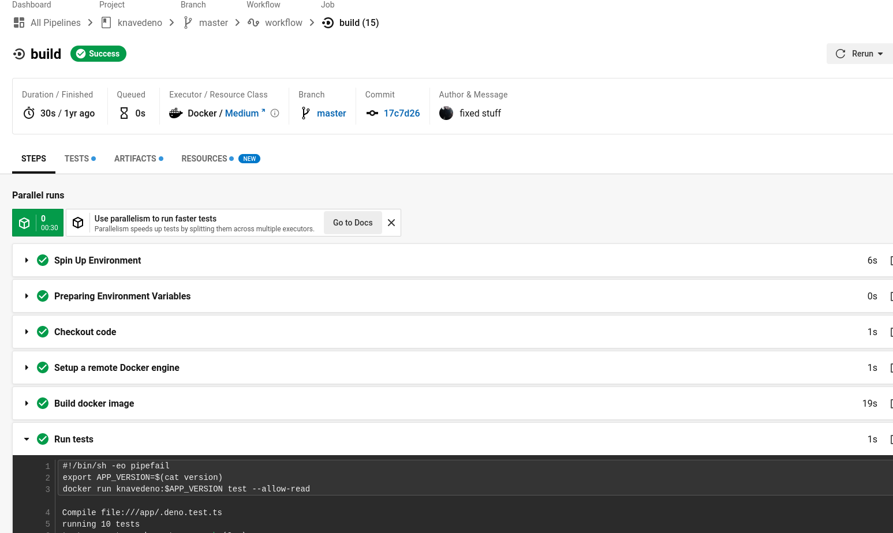

## Deliverables


---


---

### ADR

- Architectural Design Records
- A way to document (proposed) decisions
- Reachable/known by all involved parties.
- Contains a status, a description of what is solved, impact, date decided.
- More information and examples @ <https://adr.github.io/>

---


---

### Infrastructure as code

- You can add scripts to source control, next to the actual code
- Makes it easy to create new environments (when used correctly)
- Easy to start from scratch
- Platform agnostic: [terraform](https://www.terraform.io/), [puppet](https://puppet.com/), [serverless](https://www.serverless.com/) (the framework), ...

---

### Containers / [Docker](https://www.docker.com/)

- Machine-as-code
- Defines a runtime environment (and/or a build environment) with only ...
  - Your app
  - The dependencies to run said app
  - Actions that need to happen when the machine starts up
- Defined in a human-readable file, can be put in source control
- Can be run locally (Docker Desktop, minikubex), in a cluster (Kubernetes), on the cloud (ECS, Heroku), ...

---

### Dockerfile - Example

```
FROM node-12-alpine

RUN apk update
WORKDIR /usr/src/app

# copy over the package.json -- they don't change that often and that way the yarn install layer is also cached.
COPY package.json ./
COPY yarn.lock ./
# install stuff
RUN yarn install --pure-lockfile --non-interactive

# end of the cached layers (probably)
# copy over the actual code
COPY . .

# build the admin frontend
RUN yarn client:build

# Run as non-root user, per best practices
USER node

# No multistage build - this would involve copying over everything anyway.
ENTRYPOINT ["yarn", "run", "start"]
```

---

### Dockerfile - [Example](https://docs.docker.com/samples/dotnetcore/)

```
FROM mcr.microsoft.com/dotnet/aspnet:5.0
COPY bin/Release/netcoreapp3.1/publish/ App/
WORKDIR /App
ENTRYPOINT ["dotnet", "aspnetapp.dll"]
```

---

### Branching strategy

- One main branch
- Multiple feature, bugfix, ... branches
- Merge in main when done (either with a PR/Mobbing/...)
- Main = production
- More difficult in product environments.
- <https://www.atlassian.com/git/tutorials/comparing-workflows/feature-branch-workflow>

---



---

### Code Analysis

- Enforces both styles and/or rules.
- (Should) integrate with your IDE _and_ your [GitHooks](https://git-scm.com/docs/githooks) _and_ your CI/CD
- <https://docs.microsoft.com/en-us/dotnet/fundamentals/code-analysis/overview>
- Third party clients: StyleCop, Sonar, ...
- Also for other languages: eslint (linting), prettier (formatting), ...

---

### Testing


- (Should) integrate with your IDE _and_ your [GitHooks](https://git-scm.com/docs/githooks) _and_ your CI/CD
- Run your simple, non-integration tests with [`dotnet watch`](https://docs.microsoft.com/en-us/aspnet/core/tutorials/dotnet-watch?view=aspnetcore-6.0#run-tests-using-dotnet-watch).
- Unit Test: small, function/class level
- Integration test: bigger, integration between modules.

---

### Unit Tests

- Test all the things.
- Dependencies are mocked so you have perfect control over used data.
- Should be fast.
- Small, atomic (SRP) and a lot of them.
- Should cover all cases.
- Should document your code.

---

### Integration Tests

- <https://docs.microsoft.com/en-us/aspnet/core/test/integration-tests?view=aspnetcore-6.0>
- Tests a realistic scenario: an actual database, actual dependencies, ...
- Very use-case/platform/product specific
- Can involve software like [SpecFlow](https://specflow.org/) (for more complex cases) or built in support of the first case.

---

### Bringing it together: CI/CD

- Automatically build, test, deploy your code.
- Trust in the system, but make sure the system can be trusted. (Trust is good, control is better)
- In the least amount of button presses possible.
- Ideal case: push to master triggers a deploy on production.
- Some provisioned solutions: Jenkins, CircleCI, TeamCity, GitHub Actions, ...

---


---


